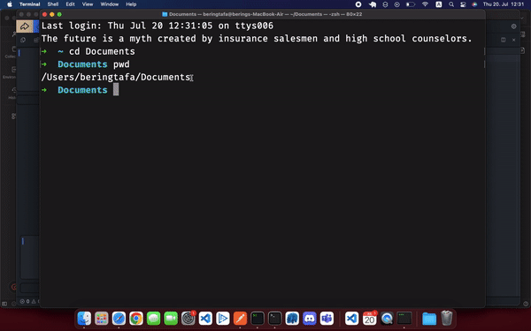

# Jacobs University Bachelor's Thesis 
## Topic:
*Integrating Real-Time Collaborative Editing into the Lapce Code Editor : An exploration of implementations and features*
## Prof: JÜRGEN SCHÖNWÄLDER[+](https://www.beadg.de/js/)



The Lapce[+](https://lapce.dev) code editor is a modern software development code editor created in the Rust programming language. With no performance sacrifices, it aims to provide users with a feature-rich environment and a user experience comparable to those of Visual Studio Code.

I am trying to contribute to the enhancement of the Lapce code editor through the implementation of new features. Consequently, the primary focus of my academic thesis centers on the incorporation of real-time collaborative editing capabilities into the Lapce platform.


### Logoot[+](https://inria.hal.science/inria-00432368/document)
----------------------------------------------------
The implementation is from scratch and is based into the Logoot implementation of CRDT.
The created crdt library file can be found in **lapce/lapce-app/src/crdt.rs**
### Running
----------------------------------------------------

```
python3 server/server/code.py
cd lapce
cargo run
```
and the executable will be availabe in **lapce/target/debug/lapce**

OR
```
cargo run --release
```
and the executable will be availabe in **lapce/target/release/lapce**

### <span style="color: red;"> DISCLAIMER </span> 
This work is still in progress. Missing features: 
- [ ] Integrating GitHub login within the welcoming interface.
- [ ] Displaying cursor positions of Collaborators: This involves indicating the position of collaborators’ cursors with their respective IDs.
- [ ] Enabling multi-character deletion: Supporting the removal of selected text chunks using the backspace key.
- [ ] Facilitating multi-character insertion: Allowing the insertion of text copied from ex- ternal sources into the system clipboard.
- [ ] Broadcasting selected text to collaborators: When a user selects a text portion, other collaborators should also see it, complete with a distinct color and the user’s ID.
- [ ] Undo i.e. CTRL-z in most text editors or U in vim modal editing
